# Phosphorite

[](https://opensource.org/licenses/MIT)
[](https://nodejs.org/)
[](https://www.typescriptlang.org/)
[](https://reactjs.org/)
[](https://socket.io/)

<p align="center">
  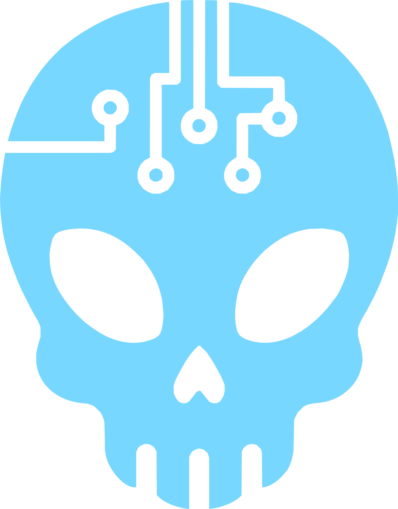
</p>

Phosphorite turns your table into a live sci-fi space station bridge: a retro terminal emulator where every player can experience a living spacecraft that evolves as you play. You can run it from a laptop or host it on a dedicated server, and start playing right away.

It lets a Game Master craft a fully controllable and cinematic player experience: live telemetry to monitor, fictional file systems to untangle, broadcasts and private comms, and AI‑powered NPCs - all interacting in real time between game master and players.

Phosphorite includes:

- telemetry simulations with warnings and alarms
- a full terminal app with files, scripts, and customizable commands
- configurable LLM chat agents with custom endpoints/models
- live messaging and broadcast overlays
- tactical maps with layers and markers
- rich theme presets and visual effects
- ... and many more awesome features!

## Support This Project

While this is not my day job, a lot of time and effort went into building Phosphorite. If you find it useful for your games, consider buying me a coffee! Your support helps me dedicate more time to improving Phosphorite and creating more awesome open-source tools like this one.

[](https://ko-fi.com/B0B41SLBNR)

## Quick Start

If you know how to use Node and npm: clone the repo, then `npm install` > `npm run build` > `npm run start`.

If you're not familiar with Git, terminals, or developer tools and just want to play, follow these simple steps to get Phosphorite running on your computer.

1) Download the project

    - Visit this repository's main page on GitHub and click the green **Code** button close to the top of the page, then choose **Download ZIP**.
    - Save the ZIP to your computer and extract/unzip it to a folder (example: `Downloads/Phosphorite`).

2) Open the exrtracted folder and double-click on the correct launcher for your operating system:

    - **Windows**: `launcher.cmd` (or `launcher.ps1` for PowerShell)
    - **macOS**: `launcher.command`
    - **Linux**: `launcher.sh`
  
    If the launcher file does not run, make sure you set its permissions to executable.
    If it runs but complains about not being able to install Node.js, please download it from [the official Node.js website](https://nodejs.org/en/download) and install it, then run the launcher again.

At the moment, I am not providing prepackaged releases of the services.
    

## Features

The game includes a substantial number of features, and I did my best to make both the GM and Player interfaces as straightforward as possible. Most interface elements can be hovered over with the mouse to display a short explanation of their purpose and usage. This is not intended as a replacement for proper documentation, which is currently a work in progress.

### Game Time

Control the in‑universe clock and keep every client in sync. The GM can pause, resume, set, advance, or roll back time (era/day/hour/minute/second), and telemetry simulations tick along with it.

### Characters

Create player logins, manage bios and narrative hooks, and monitor player activity (current app, section, last activity) in real time. You can also toggle whether a character has access to comms.

#### Temporary Visual Effects

Layer cinematic effects onto a player’s terminal at any moment: break their screen, make it flicker, have their text glitch. Great for jump scares, damage events, and narrative beats.

<table>
  <tr>
    <td>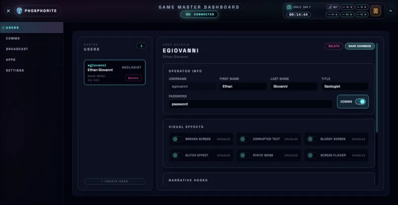</td>
    <td>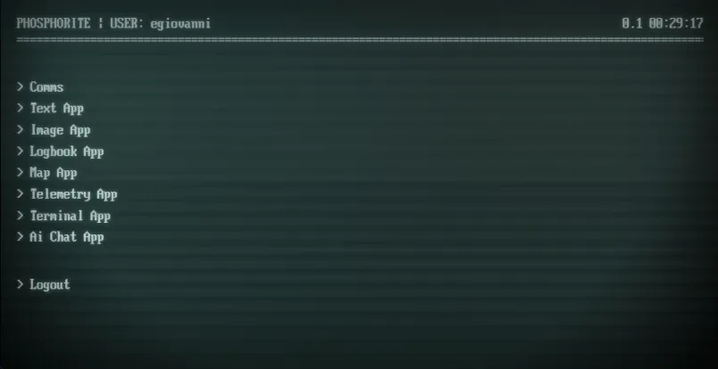</td>
  </tr>
</table>

### Messaging

In‑universe mailing system. The GM can send messages to any recipients, and players can compose their own messages to other characters (if enabled). The GM can monitor and control all conversation (which is awesome if you like to gaslight your players).

<table>
  <tr>
    <td>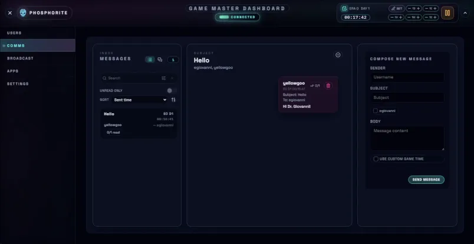</td>
    <td>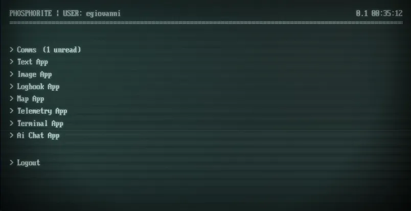</td>
  </tr>
</table>

### Broadcasts

Push full‑screen, time‑limited broadcasts to selected players: either a text transmission or an image. Perfect for alerts, mission updates, or atmospheric interludes.

<table>
  <tr>
    <td>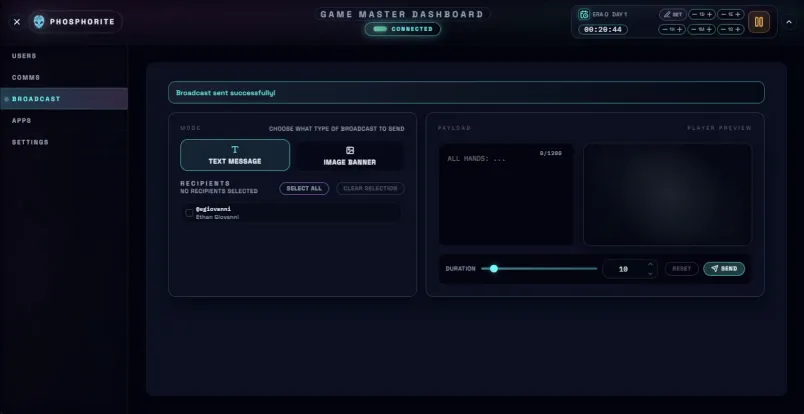</td>
    <td>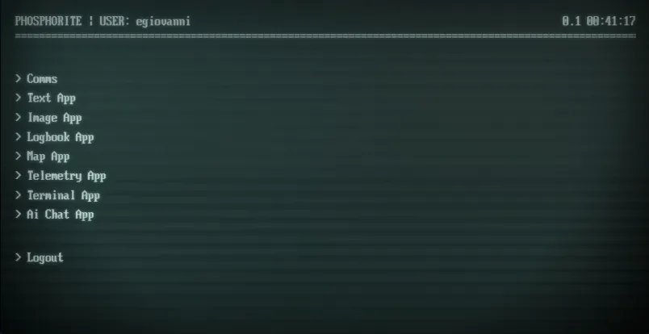</td>
  </tr>
</table>

### Apps

Apps are the main building blocks of Phosphorite. The GM can create, reorder, and customize apps, and set which players can access each one. Each app category has a different purpose, and provides a different interface to both the GM and the players:

#### Text

Contains a simple long‑form text payload (AKA lore drop).

<table>
  <tr>
    <td>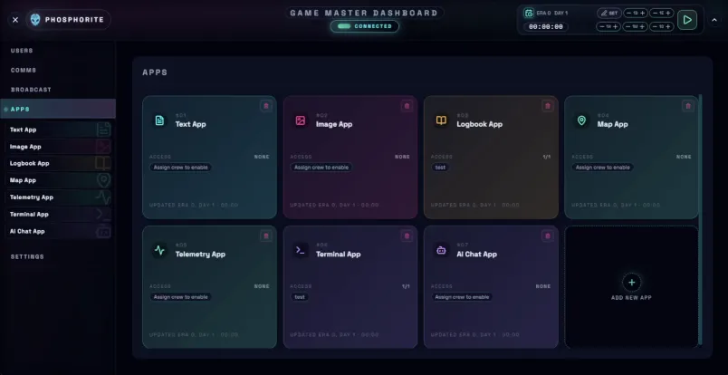</td>
    <td>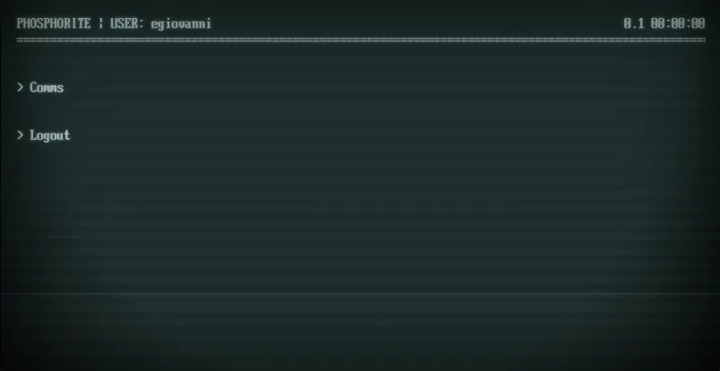</td>
  </tr>
</table>

#### Image

Contains a single image payload (under 3 MB).

<table>
  <tr>
    <td>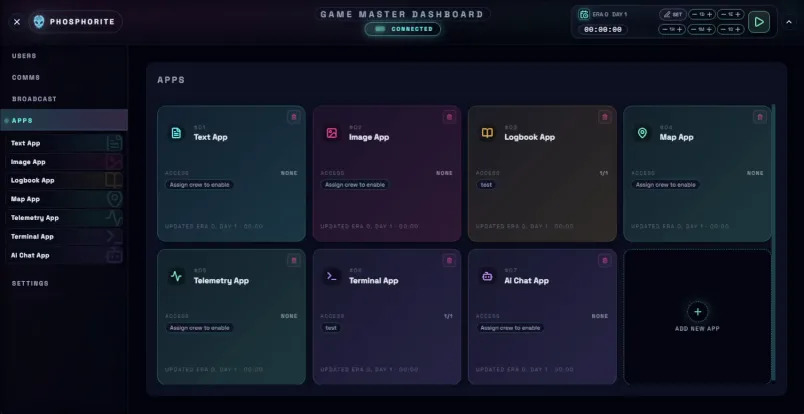</td>
    <td>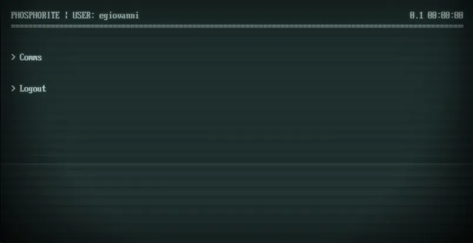</td>
  </tr>
</table>

#### Logbook

Build time‑stamped log entries (severity‑coded) and let players browse by time to find out what happened in the past.

<table>
  <tr>
    <td>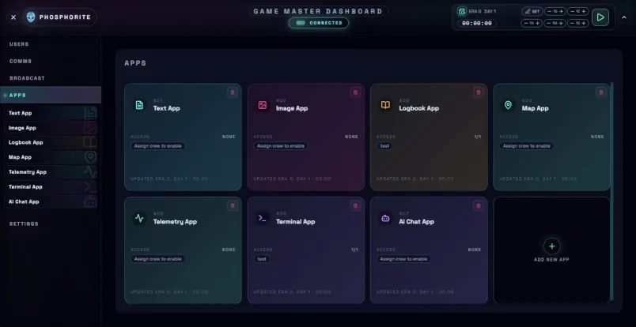</td>
    <td>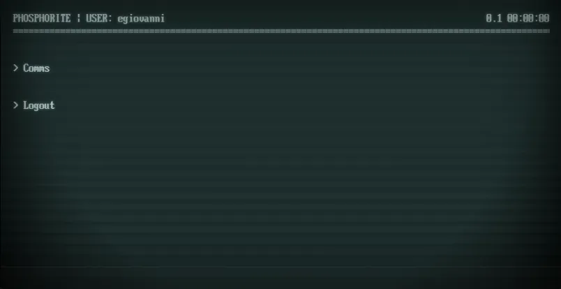</td>
  </tr>
</table>

#### Map

Create tactical maps with layers and markers. Players can cycle layers client‑side while you update the scene live.

<table>
  <tr>
    <td>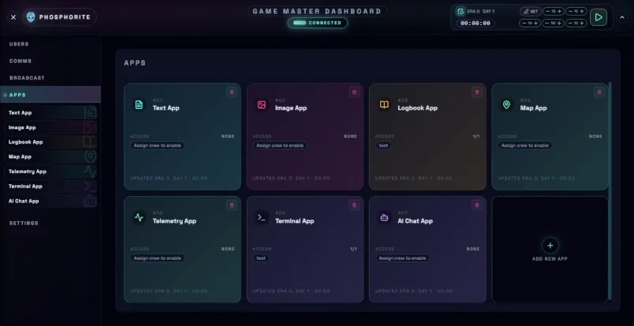</td>
    <td>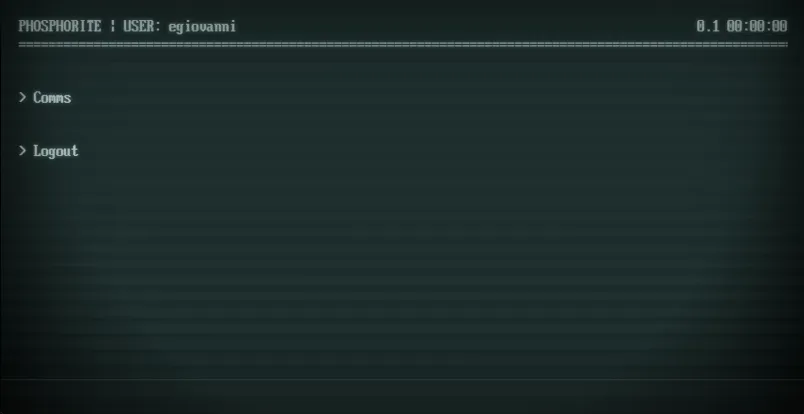</td>
  </tr>
</table>

#### Telemetry

Define monitoring groups with numerical and textual parameters. Values simulate toward targets with some noise, and clients show them in real-time along their nominal/warning/critical state.

<table>
  <tr>
    <td>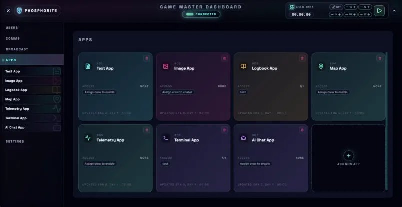</td>
    <td>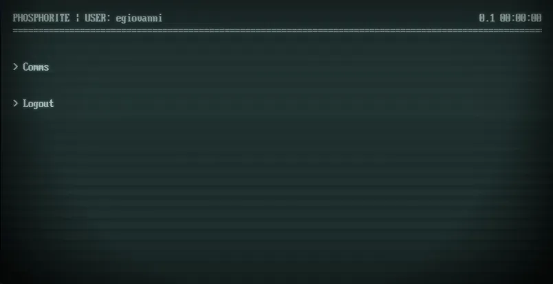</td>
  </tr>
</table>

#### Terminal

Build a faux filesystem, add custom commands, and decide whether each command auto‑responds or requires a manual response from the GM.

<table>
  <tr>
    <td></td>
    <td>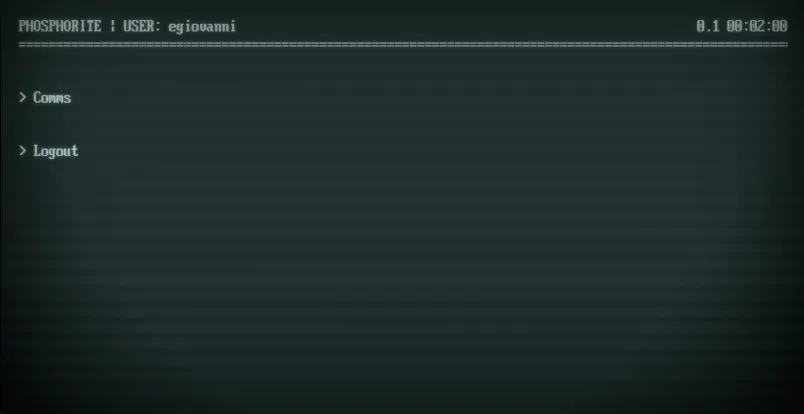</td>
  </tr>
</table>

#### AI chat

Configure one or more chat presets (based on OpenAI API) and let players speak with in‑world agents. The GM can review interaction history.

<table>
  <tr>
    <td>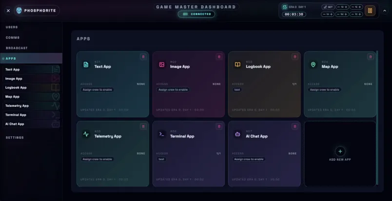</td>
    <td>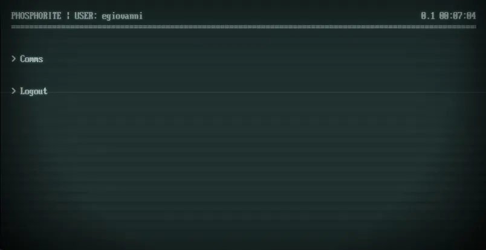</td>
  </tr>
</table>

Each agent has access to public information (telemetry readings, log entries) and private information (character narrative hooks and their comms). Please note that AI agents can easily spiral into extreme hallucinations when told they are an NPC on board of a fictional space station, so I suggest to use this with caution!

### Themes

Tune the player terminal look and feel: color palette, gradients, glows, typography, and cinematic overlays. Includes multiple presets and a preview of what the players will see.

<table>
  <tr>
    <td>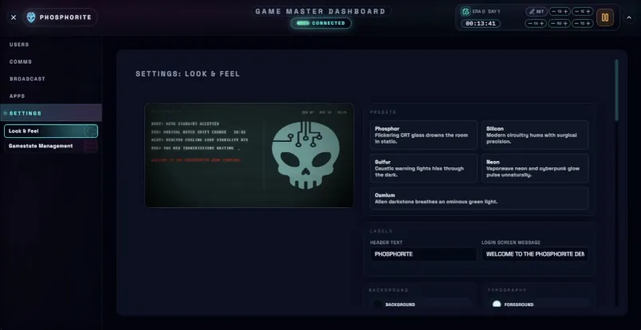</td>
    <td>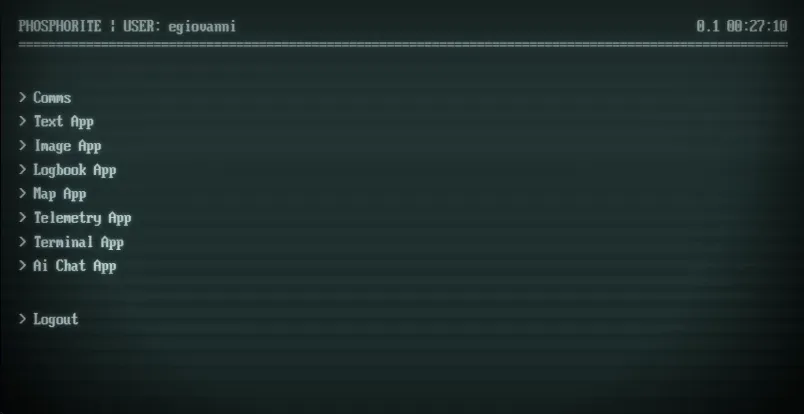</td>
  </tr>
</table>

### Exporting and Importing Game Data

Export or import snapshots of your games. The gamestate panel lets you pick exactly which information to include in your exports and imports, preview data, and restore. Please note that any import will overwrite the current contents of the affected sections!

## Architecture

Phosphorite is composed by three services that talk to each other in real-time:

- the **backend**, which helps keeping everything in sync (Express + Socket.IO API with a SQLite database and TypeScript)
- the **Game Master dashboard** (Vite + React) gives full control over the simulation
- the **Player Terminal** (Vite + React) offers a terminal-like interface for players to interact with

Each package is independent; the root `package.json` only coordinates installs and scripts.

## Requirements

- Node.js 18+
- npm 10+
- Docker (optional, if you want to run it from a container)

## Configuration

Every service reads the same environment variables. Copy `.env.example` to `.env` (or `.env.local`) and tweak as needed:

```bash
# ports you want exposed on your machine
PHOS_BACKEND_PORT=3100
PHOS_GM_PORT=5173
PHOS_PLAYER_PORT=5174

# optional host bindings/origins
PHOS_BACKEND_HOST=0.0.0.0
PHOS_GM_HOST=0.0.0.0
PHOS_PLAYER_HOST=0.0.0.0
PHOS_BACKEND_ORIGIN=
```

The backend defaults to `3100`, GM dev server to `5173`, player dev server to `5174` when the variables are missing.

## Launching the services

Four launcher scripts are provided, use the correct one for your operating system:

- **Windows PowerShell**: double-click `launcher.ps1` or run from PowerShell
- **Windows CMD**: double-click `launcher.cmd` or run from Command Prompt
- **macOS / Linux**: make `launcher.sh` executable once, then run:

  ```bash
  chmod +x launcher.sh
  ./launcher.sh
  ```

- **macOS (Finder)**: make `launcher.command` executable once, then double-click:

  ```bash
  chmod +x launcher.command
  # Then double-click launcher.command
  ```

The launcher opens a shell from which you can:

1. **Install and build**: installs the requirements to run all services, then builds
2. **Configure ports**: customize backend/GM/player ports
3. **Start the game**: starts the three services

The launcher tracks running processes so you can stop or relaunch the stack cleanly.
All launchers use the same Node.js logic from `scripts/bootstrap.js`.

### Running with Docker

```bash
cp .env.example .env   # if you haven't already
docker compose up --build
```

The compose file builds images and exposes the same configurable ports.

## Local Development

1. **Install dependencies:**

   ```bash
   npm install # installs backend/, gm-client/, player-client/
   ```

2. **Start the stack:**

   ```bash
   npm run dev
   ```

   This concurrently launches:
   - Backend on `http://localhost:${PHOS_BACKEND_PORT}`
   - GM dashboard on `http://localhost:${PHOS_GM_PORT}`
   - Player terminal on `http://localhost:${PHOS_PLAYER_PORT}`

To work on a single package you can still `cd` into it and run `npm run dev` / `npm run build` / `npm start` as usual.

## Troubleshooting

- **Ports busy**: edit `.env` with free ports or stop conflicting processes.
- **Database locked**: stop all running backends and delete `backend/data/phosphorite.db` (it will be recreated, but game data will be lost).
- **WebSocket errors**: ensure the backend is reachable at the host/port the clients proxy to (`PHOS_BACKEND_ORIGIN` if set).

## Contributing

Contributions are welcome! Feel free to open an issue or submit a pull request.

## License

This project is licensed under the MIT License - see the [LICENSE](LICENSE) file for details.

## Acknowledgments

Inspired by [redhg/phosphor](https://github.com/redhg/phosphor) - a brilliant implementation of a terminal for running The Haunting of Ypsilon 14.
