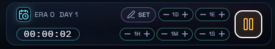
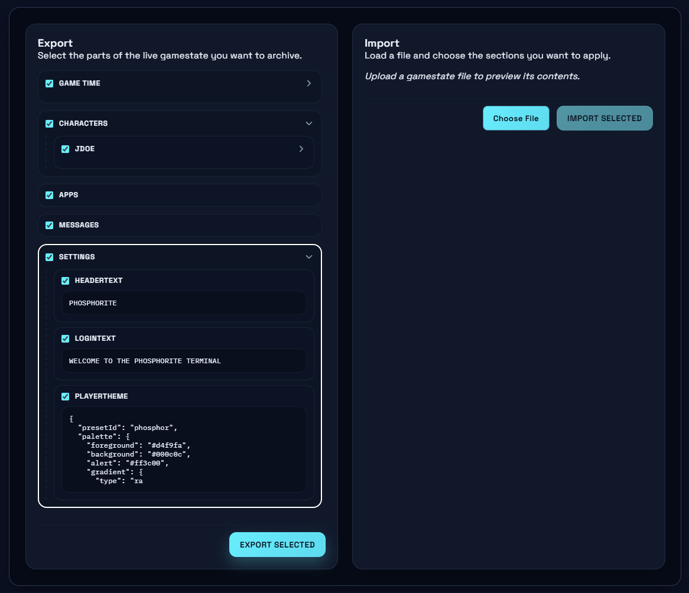
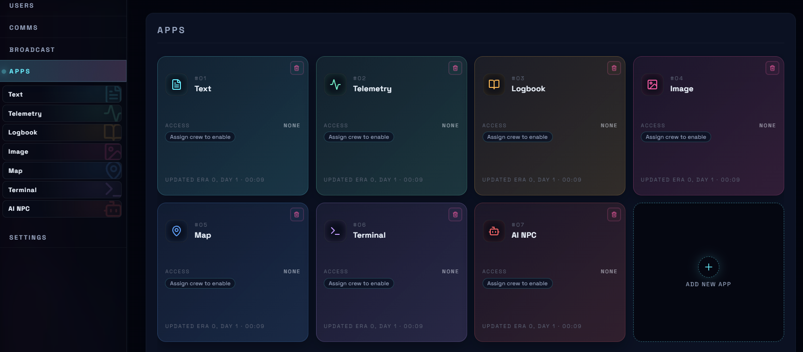
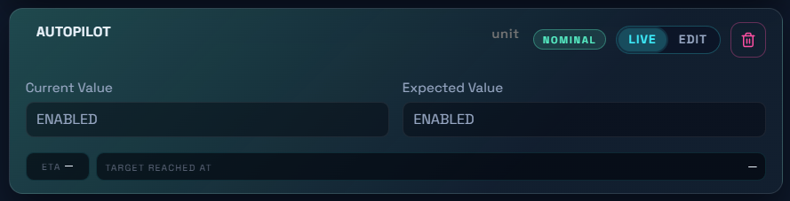
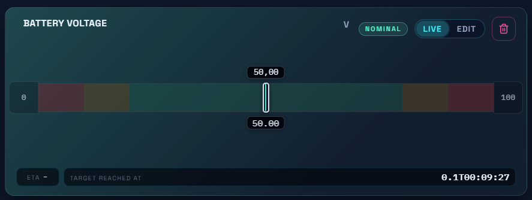
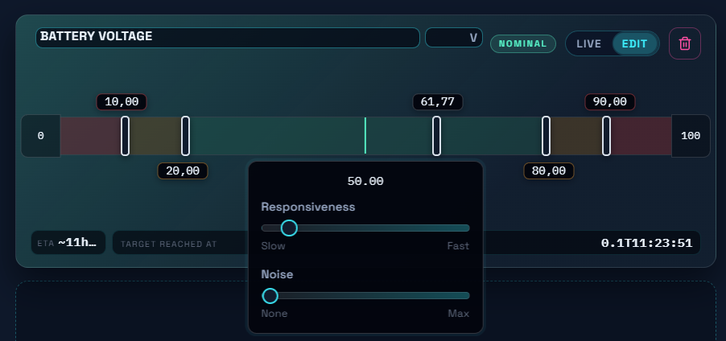

# Phosphorite Tutorial

This guide walks through the main Phosphorite features from the Game Master point of view. It is meant as a practical reference while preparing or running a session.

## Overview

Phosphorite runs as three services working together in real time:

- the **Backend** stores the game state and keeps the clients synchronized. It has no dedicated interface and is not meant to be used directly during play.
- the **Game Master Client** is the control panel. It exposes the current game state, built-in controls, and the modular content blocks called **Apps**.
- the **Player Client** is the in-universe terminal seen by players. What players can access depends entirely on the permissions and content configured by the Game Master.

## Launching Phosphorite

To get started, download the latest release from GitHub, extract it, and launch the **Phosphorite Launcher**. The launcher binaries are currently unsigned, so your operating system may show a security warning the first time you open them. Make sure you are using a release downloaded from a trusted source.

The launcher can start all three services and lets you choose the ports they run on. The backend must be running for the Game Master and Player clients to work correctly.

The launcher also shows local network addresses for the running services. That means other devices on the same network, such as a tablet connected to the same Wi-Fi, can open the Game Master or Player clients in a browser. Exposing Phosphorite to the public internet is not recommended unless you know exactly how you want to secure it.

If you do not want to run unsigned binaries, you can also run Phosphorite with Docker or directly from source using Node.js.

## Recommended First-Time Setup

For a smooth first session, this is a good order to follow:

1. Start the backend, then the Game Master client, then the Player client.
2. Create at least one user account for testing.
3. Create a few apps and assign access permissions.
4. Adjust the player terminal theme under **Settings**.
5. Log into the Player client with your test account and verify what a player can actually see.

## Features

### Game Time

Phosphorite keeps track of in-game time using the format **Era > Day > Hour > Minute > Second**. Eras start at 0 and can increase indefinitely. Hours, minutes, and seconds follow the familiar 24/60/60 clock.

From the top bar, the Game Master can pause, resume, advance, or rewind time. This matters because several systems depend on the clock. Telemetry simulations, for example, advance on each tick and stop changing when the clock is paused.

### Users

Users are the access-control layer of the Player client. Each one represents a login identity with its own permissions, profile information, and available content.

<table>
  <tr>
    <td></td>
    <td></td>
  </tr>
</table>

From the Game Master client you can create new users and edit existing ones. Each user must have a unique username, a first and last name, a title such as "Captain" or "Chief Engineer", and a password. Players use the username and password together to log into the Player client.

You can also fill in optional profile fields such as background, personality, fear, secret, motivation, and agenda. These are not required for basic play, but they are useful if you want to keep richer notes in the GM interface or pass more context to AI agents.

The user area also contains a **COMMS** toggle. This grants or denies access to the in-universe messaging system. If COMMS is disabled, that user can still log in and use other parts of the terminal, but they will not be able to use messaging.

This section also contains controls for temporary visual effects. These let you apply screen distortions or other disruptive overlays to a specific logged-in user, mainly to create dramatic moments or make the contents of their screen harder to read.

The most natural setup is one user per player, but that is not the only valid approach. You could instead create one user per workstation on the ship, or define role-based users such as engineer, captain, or scientist. If someone logs in with a user that is already active on another machine, the older session is replaced.

### Messaging

Messaging is Phosphorite's in-universe mail system. The Game Master can send messages to any recipients, and users with COMMS access can send and receive their own messages to and from other users.

<table>
  <tr>
    <td></td>
    <td></td>
  </tr>
</table>

The interface is split into three areas. The left panel is used to filter messages and group them into conversations, usually by subject. The center panel shows the currently selected conversation. The right panel is used to compose new messages.

Messages are shown as conversation bubbles, and the Game Master can click individual bubbles to edit messages after they have been sent. This makes the system useful not only for normal communication, but also for intervention, retconning, deception, or quietly steering the flow of information during play.

### Broadcast

Broadcasts push a full-screen overlay to selected users for a limited amount of time. A broadcast can contain either text or an image.

<table>
  <tr>
    <td></td>
    <td></td>
  </tr>
</table>

From the Broadcast screen, the Game Master chooses the payload type, selects the target users, and sets how long the broadcast should remain visible. Once sent, it temporarily takes over the selected players' screens.

This is useful for alarms, mission updates, command announcements, jump-scare moments, or any other event that should interrupt normal terminal use for a few seconds.

### Settings

#### Look & Feel

This section controls the presentation of the Player client. You can start from a preset and then tweak individual elements such as colors, text treatments, and visual effects. Changes can be made while the game is running, so you can shift the atmosphere mid-session if needed.

The settings apply globally to the Player client. At the moment it is not possible for separate users to have different graphical themes.

<table>
  <tr>
    <td></td>
    <td></td>
  </tr>
</table>

#### Gamestate Management

The gamestate tools let you export and import saved data between different sessions or campaigns.

When exporting or importing, you can choose exactly which sections to include. Be careful when importing: the imported sections replace the current contents of those sections.

Saved data is stored as JSON. You can edit an exported file manually if you keep the structure intact, which can be useful when merging or batch-editing large amounts of content.

### Apps

Apps are the main building blocks in Phosphorite. The Game Master can create them, reorder them, configure their contents, and decide which users can access them.

From the App Overview you can create new apps, choose their category, reorder them by dragging, and delete them when they are no longer needed. Apps can be reordered both from the sidebar and from the main overview, and players see them in that same order.

After creation, an app's name and category are fixed, but its content and access permissions remain editable. Each app also has an **Access Control** section. Newly created apps are private by default until you explicitly grant access to one or more users.

#### Text App

The Text App contains a long-form text payload. It is useful for briefings, lore, manuals, reports, or any other content the players only need to read. On the GM side you simply edit the body text; on the player side the app opens as a read-only text view.

<table>
  <tr>
    <td></td>
    <td></td>
  </tr>
</table>

#### Image App

The Image App stores a single image payload up to 3 MB. On the GM side you upload or replace the image; on the Player client users can open it and scale it to fit their screen.

<table>
  <tr>
    <td></td>
    <td></td>
  </tr>
</table>

#### Logbook App

The Logbook App lets the Game Master build a timeline of timestamped entries. Each entry has a timestamp, a severity level, an author, and a body of text.

Players cannot write to the logbook, but they can browse it to investigate past events. They can move through the log either one day at a time or by jumping to a specific date, which makes the app useful for ship records, incident logs, scientific observations, or mission archives.

<table>
  <tr>
    <td></td>
    <td></td>
  </tr>
</table>

#### Map App

The Map App lets you build live maps with multiple layers and movable markers. Markers can be placed freely, so if your scenario requires strict positioning it is a good idea to bake a grid directly into the map image.

<table>
  <tr>
    <td></td>
    <td></td>
  </tr>
</table>

From the Game Master interface you can use the controls above the map area to load an image as a layer, add new layers, rename them, switch between them, and remove them. Marker Storage is used to define reusable markers with a name, icon, and color.

Once a marker has been created, it can be dragged onto the map to make it visible to players and moved around freely. If you no longer want it on the map, you can return it to storage. Players can switch between visible layers and see marker movements in real time.

#### Telemetry App

The Telemetry App simulates numerical and textual system readings that update over time.

<table>
  <tr>
    <td></td>
    <td></td>
  </tr>
</table>

The first step is to create one or more monitoring groups, such as life support, propulsion, or power distribution. You can then add parameters inside each group.

Telemetry parameters come in two forms:

- **Numerical** parameters use a numeric value, such as `19.6 V` or `101.3 kPa`, and simulate movement toward a target on each in-game tick.
- **Textual** parameters use a string value, such as `ENABLED` or `OFFLINE`.

Textual parameters do not change automatically. Instead, they define an expected value and can be shown to players as abnormal when the current value does not match.

Numerical parameters are more sophisticated. Their current value is shown as a moving marker and drifts toward a target set by the Game Master. You can control responsiveness, noise, allowed range, warning thresholds, and alarm thresholds.

To change these values, enter edit mode using the pill in the top-right corner of the parameter card. In edit mode you can adjust:

- the parameter name and unit, by typing in the text boxes at the top
- maximum and minimum allowed values, by typing in the boxes at the far ends of the colored bar
- red and yellow thresholds, by dragging them around or typing a valid value in the corresponding text box; note that yellow thresholds cannot go beyond red thresholds
- target value, by dragging it around or typing a valid value in the corresponding text box
- responsiveness and noise, by clicking on the current value and adjusting the sliders

#### Terminal App

The Terminal App lets you build a fake filesystem and custom command set for players to interact with through a command-line interface.

<table>
  <tr>
    <td></td>
    <td></td>
  </tr>
</table>

The app has four main tabs:

- **Files** is where you create folders and files, control visibility and permissions, and define what a file shows when it is opened or executed.
- **Commands** is where you add custom commands, describe what they do, define the extra inputs they can accept, and decide whether they respond automatically or require manual approval from the Game Master.
- **Queue** lists player commands that are waiting for a manual response.
- **History** shows a record of command activity across the game.

The shell already includes built-in navigation and utility commands, so players can explore the filesystem even before you add your own content.

In the **Files** tab, files and folders expose quick toggles for their attributes directly on the file tree. These attributes are the small buttons with letters on them, which can be clicked to turn each behavior on or off. They let you decide how the item behaves for the player.

The buttons mean the following:

- **H**: hidden. The file or folder is hidden from normal listings.
- **R**: read. The player is allowed to open and read the item.
- **W**: write. The player is allowed to modify the item.
- **X**: execute. The player is allowed to run the file.
- **AUTO**: the file runs automatically without waiting for a Game Master response. If AUTO is turned off, execution is handled manually by the Game Master instead.

In practice, the file and folder attributes control things such as:

- whether the item is visible at all
- whether it can be opened and read
- whether it can be changed
- whether it can be run like a command or script
- whether it is allowed to run automatically in special cases

Folders use the relevant subset of these controls, while files can use the full set. This means you can make a file behave like a normal readable document, a hidden clue, a locked item that cannot be opened yet, or something the player can execute to trigger a response.

Files can also define two different outputs. One output is shown when the player opens the file to read it, while the other is shown when the player runs it. This is useful when you want the same file to act both as a document and as an interactive object.

In the **Commands** tab, you can define:

- the command name and short description
- whether the command appears in `help`
- whether it runs automatically or waits for a Game Master response
- a longer manual entry for `man`
- any extra pieces of information the player can type after the command, whether they are required, and what value should be assumed if the player leaves them out

If you are not familiar with command-line terminology, you can think of these extra pieces of information as slots the player fills in when using a command. For example, a command might ask for a target name, a room number, or a code word.

If a command is configured for manual execution, the Game Master receives a prompt when a player runs it and can decide what response to send back. While that request is pending, the player is effectively waiting on the GM.

Automatic commands use a response template. This lets you craft outputs that change depending on what the player typed or on what exists in the virtual filesystem. The interface includes an info panel with the available template rules and examples.

The **Queue** tab is where you review pending manual commands, while the **History** tab gives you a record of what users tried to run and what responses they received.

#### AI Chat App

The AI Chat App lets players talk to one or more in-world agents through an OpenAI-compatible API. The Game Master can configure agents, switch between presets, and review conversation history.

<table>
  <tr>
    <td></td>
    <td></td>
  </tr>
</table>

The important distinction is that an app can contain one or more agents, and each agent can have multiple presets. In practice, this means you do not need to create a brand new agent every time you want the same in-world entity to behave differently. Instead, you can prepare multiple presets for that single agent and switch between them during play.

For each preset you provide:

- a label for the GM interface
- the API endpoint
- the model name shown in the UI
- the model identifier sent to the API
- an API token
- system instructions describing the agent's behavior

You can also choose which contextual information is passed to the agent, including in-game time, user profile data, messages, logbooks, telemetry, and available terminal commands. When a user speaks to an agent, private context is limited to that user rather than all users globally.

This is especially useful if you want one agent to have several modes. For example, the ship AI could have a normal preset, an emergency preset, and a corrupted preset, all under the same agent. That keeps the identity of the agent consistent while still letting you change its behavior quickly.

The GM interface also makes it possible to review interaction history, inspect conversations by user, and switch between presets during play. This makes it easier to adapt the agent live as the session evolves.